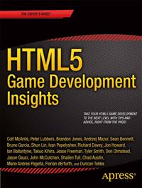

#Apress Source Code

This repository accompanies [*HTML5 Game Development Insights*](http://www.apress.com/9781430266976) by Colt McAnlis, Peter Lubbers, Brandon Jones, Andrzej Mazur, Sean Bennett, Bruno Garcia, Shun Lin, Ivan Popelyshev, Jon Howard, Ian Ballantyne, Takuo Kihira, Jesse Freeman, Tyler Smith, Don Olmstead, Jason Gauci, John McCutchan, Chad Austin, Mario Andres Pagella, Florian dErfurth, and Duncan Tebbs (Apress, 2014).

Download the files as a zip using the green button, or clone the repository to your machine using Git.

##Releases

Release v1.0 corresponds to the code in the published book, without corrections or updates.

##Contributions

See the file Contributing.md for more information on how you can contribute to this repository.
